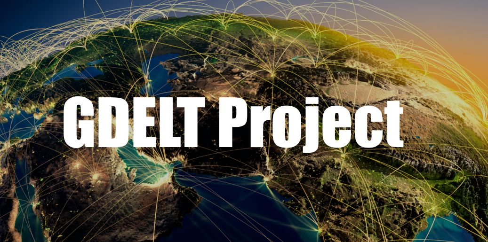

# Projet NO-SQL INF728
Projet de Chloe Youness, Erwan Floch, Nicolas Louis, Thomas Riviere, Vincent Martinez

## But du projet
Le sujet du projet est disponible à l'adresse suivante: http://andreiarion.github.io/projet2019.html

Le but du projet est la modélisation d'un système sur **AWS** pour la modélisation de 4 requetes:

*L’objectif de ce projet est de proposer un système de stockage distribué, résilient et performant sur AWS pour repondre aux question suivantes:*
* *afficher le nombre d’articles/évènements qu’il y a eu pour chaque triplet (jour, pays de l’évènement, langue de l’article).*
* *pour un pays donné en paramètre, affichez les évènements qui y ont eu place triées par le nombre de mentions (tri décroissant); permettez une agrégation par jour/mois/année*
* *pour une source de donnés passée en paramètre (gkg.SourceCommonName) affichez les thèmes, personnes, lieux dont les articles de cette sources parlent ainsi que le le nombre d’articles et le ton moyen des articles (pour chaque thème/personne/lieu); permettez une agrégation par jour/mois/année.*
* *dresser la cartographie des relations entre les pays d’après le ton des articles : pour chaque paire (pays1, pays2), calculer le nombre d’article, le ton moyen (aggrégations sur Année/Mois/Jour, filtrage par pays ou carré de coordonnées)*

**Notre approche est une approche en streaming, jour par jour. Les données peuvent être ajoutées au fur et à mesure.**

## Organisation du repository

**Repertoire ansible:**
création des machines virtuelles pour la base de donnée Cassandra, paramétrisation des machines, lancement du cluster cassandra. Les tables ne sont pas créées lors de cette opération. 

**Repertoire processing data:**
Scripts pour la récuperation des données, parsing, et prépartion des données et rangement dans les tables Cassandra

**Repertoire notebooks:**
Notebook jupyter pour la présentation des résultats. Necessite quelques plugins (plotly, pandas...)

**Repertoire Presentation:**
Présentation effectuée lors de la restitution

## Organisation du projet
Pour les taches du projet, nous avons mis en place un kanboard (https://github.com/Martinez-TAD/INF728_NoSQL/projects/1).

## Chargement des données:
Editer les fichiers build.sbt et build_and_submit pour y mettre vos variables (comme pour le projet Spark)

Il faut lancer le script suivant:
./build_and_submit.sh LoadingCSVFiles

Nous avons fais en sorte que le lancement se fasse en arriere plan. Si vous voulez l'avoir en premier plan, il faut retirer la commande nohup de la derniere ligne du script (on aura donc directement le spark_submit) et le '&' en fin de ligne.

## Creation du cluster de test Cassandra:

**AWS Cassandra**:
Lancer le script ansible via la commande ansible-playbook.

**Cluster local**:
Il suffit de faire l'installation de ccm pour avoir un cluster. Cassandra n'est pas necessaire; il sera directement télécharger.
Pour installer ccm (https://academy.datastax.com/planet-cassandra/getting-started-with-ccm-cassandra-cluster-manager):
on clone le git du projet:

git clone https://github.com/pcmanus/ccm.git

Puis on l'installe:
cd ccm && ./setup.py install

Une fois installée, on peut lancer les commandes suivantes pour faire un git. Pour les personnes sur Mac (Nico, je parle de toi :p), regarde la doc, tu as 2 commandes à faire en plus.

* ccm create test -v 3.11.5
* ccm list
* ccm populate -n 3
* ccm list
* ccm start
* ccm status

Arriver ici, vous devriez avoir:

Cluster: 'test'

node1: UP
node2: UP
node3: UP

## Création du keyspace et des tables:

Sur un noeud Cassandra, lancer csqlsh puis lancer:

* CREATE KEYSPACE NoSQL WITH replication = {'class': 'SimpleStrategy', 'replication_factor': 3};
* use nosql ;

### Requete 1:

CREATE TABLE requete1 (jour int, pays text, langue text, count int, PRIMARY KEY ((jour), pays, langue));

### Requete 2:

La table de mapping sert de table pivot pour la requete 2 et 4.

create table requete2(year int, monthyear int, day int, country text, count int, eventid text, PRIMARY KEY((country), year, monthyear, day, eventid)) WITH CLUSTERING ORDER BY (year desc, monthyear asc, day asc, eventid desc);

create table requete2mapping(eventid text, day int, country text, count int, sumtone int, actor1countrycode text, actor2countrycode text, actor1lat text, actor2lat text, actor1long text, actor2long text, PRIMARY KEY(eventid));  

### Requete 3, dispo dans le master
 Creations de trois tables distinctes : une pour les themes, une pour les Personnes et la derniere pour les lieux (nous avons retenu les pays).
 
 Clé de partition : La source, c'est sur elle que nous allons requeter, et elle permet intuitivement un bon partitionnement.
 Clé de clustering : year, month, day qui permettra les aggrégations demandées.
 
 Créations des tables:
- CREATE TABLE req31(year int, month int, day int, source text,count int, theme text, tone double, PRIMARY KEY((source),year, month, day, count)) WITH CLUSTERING ORDER BY (year desc, month asc, day asc, count desc);
- CREATE TABLE req32(year int, month int, day int, source text,count int, person text, tone double, PRIMARY KEY((source),year, month, day, count)) WITH CLUSTERING ORDER BY (year desc, month asc, day asc, count desc);
- CREATE TABLE req33(year int, month int, day int, source text,count int, location text, tone double, PRIMARY KEY((source),year, month, day, count)) WITH CLUSTERING ORDER BY (year desc, month asc, day asc, count desc);

### Requete 4
create table req41(year int, monthyear int, day int, pays1 text, pays2 text, averagetone float, numberofarticles int, PRIMARY KEY ((pays1),year,monthyear,day,pays2)) WITH CLUSTERING ORDER BY (year desc, monthyear desc, day desc); 

## Lancement des scripts:

Pour la requete 1 et 2: 
./build_and_submit.sh EventMentionETL

Pour la requete 3:
./build_and_submit.sh GKG_ETL

Pour la requete 4:
./build_and_submit.sh Requete4

